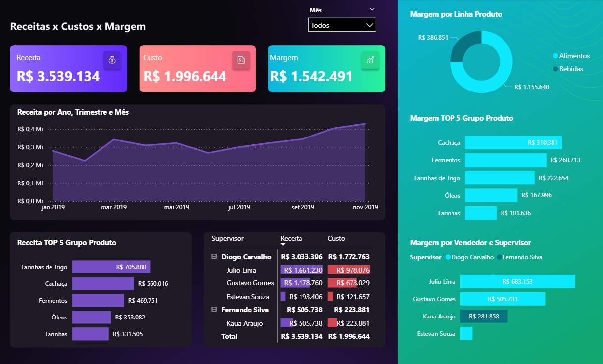

# 📊 Dashboard Power BI – Receita, Custo e Margem

Este projeto foi desenvolvido durante o **Minicurso Gratuito de Power BI da Xperiun**, com o objetivo de criar um painel interativo e visualmente atrativo para análise de **Receita, Custo e Margem**, segmentado por produto, supervisor e período.

## 🎯 Objetivo
Ajudar gestores a tomarem decisões baseadas em dados, identificando gargalos de custo e oportunidades de aumento de margem por categoria de produto ou equipe de vendas.

## 🧰 Ferramentas e Tecnologias Utilizadas
- **Power BI Desktop**
- **DAX (Data Analysis Expressions)**
- Segmentações visuais e filtros por período
- Cartões, gráficos de barras, linha e rosca
- Layout com tema escuro e responsivo

## 📌 Funcionalidades
- KPIs: Receita Total, Custo Total e Margem
- Segmentação por Mês
- Ranking TOP 5 Grupos de Produtos por Receita e Margem
- Comparação por Linha de Produto e Supervisor
- Margem por Vendedor

## 📸 Captura de Tela

## 📂 Estrutura do Repositório
- `BaseVendasCompleta.xlsx` → Base de dados vendas no Excel
- `CadastroProdutos.xlsx` → Base de dados produtos no Excel
- `README.md` → Documento de apresentação do projeto
- `certificado-minicurso-powerbi-xperiun.pdf` → Certificado de conclusão do curso
- `dashboard-captura.png` → Imagem ilustrativa do dashboard
- `dashboard-receita-custo.pbix` → Arquivo do projeto no Power BI

## 🚀 Insights Possíveis
- Quais produtos geram maior margem de lucro?
- Qual supervisor entrega melhor resultado?
- Comparativo de custo e margem por categoria

## 🔗 Fonte do Curso
Curso realizado em:  
[Minicurso Gratuito Power BI – Xperiun](https://app.xperiun.com/modulos/minicurso-de-power-bi-1704330688604x253300448047862660)

## 📬 Contato
Desenvolvido por [Paulo Henrique Lima](https://www.linkedin.com/in/paulohenriquelima95/)  
👨‍💻 Buscando oportunidades como **Analista de Dados Júnior**

---

> ⭐️ Se você gostou deste projeto, não esqueça de deixar uma estrela no repositório!
